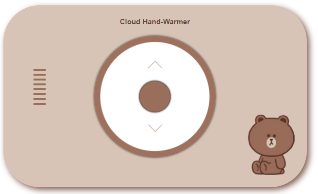
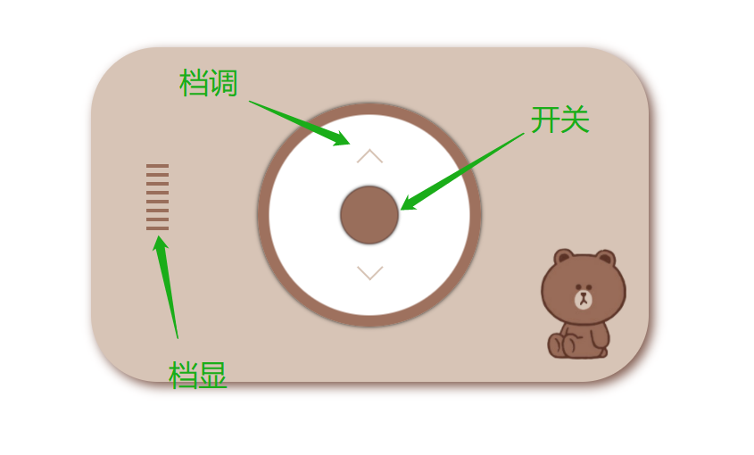
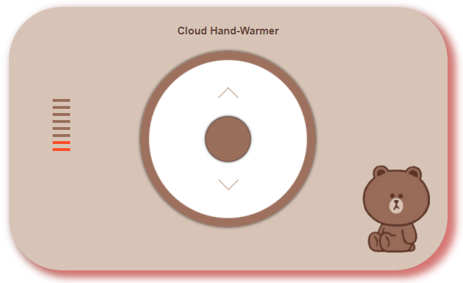

## 云暖手宝  

为什么要做这个产品，请点击 [WHY](./why.md)  

[开始使用](https://blog-8gvwbiz0f81b6ce8-1258448523.tcloudbaseapp.com/hand-warmer/dist/index.html)
### 产品优势

  

- 基于云，无需携带，随时随地使用  
- 可视化操作，颜值大方美观可爱，操作简单  
- 加热过程呼吸式设计，温暖进你心里
- 最高温度和设备绑定，完全自适应，设备越旧效果越好，完全照顾低端市场  
- 不用花钱，永久免费！！！  

### 使用指南  
云地址：[点击进入](https://blog-8gvwbiz0f81b6ce8-1258448523.tcloudbaseapp.com/hand-warmer/dist/index.html)  

点击 `中间开关` 启动暖手宝，`上下箭头` 调整温度挡位。左侧为档显，目前一共有八个档位，如果你对你的电脑不自信，请你一丢丢一丢丢加档，否则一切损失与我无关，ε=ε=ε=┏(゜ロ゜;)┛

当开关打开时，周围呼吸灯亮起，左侧档线显示当前挡位，可以通过档调来调节。  

  

再次点击开关，呼吸灯熄灭，档显熄灭，关闭暖手宝。  

### 免责说明  

- 主板烧了别找我（问问老板算不算工伤）
- 网页崩溃资料没保存别找我
- 暖和吗，暖和就完事儿了  
- 什么？最高挡位你都感觉不到温度？（大佬，你滴电脑大大滴好）  
- ......